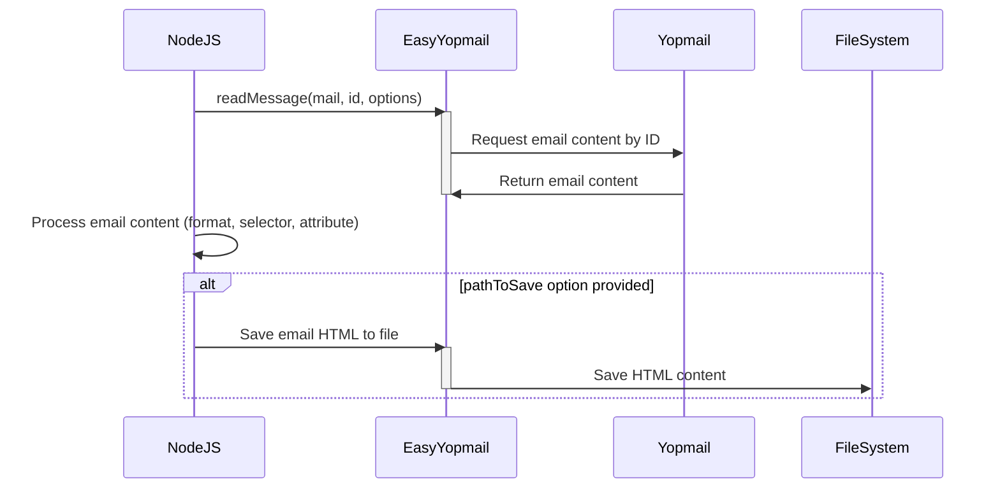

# 📑 readMessage()

The `readMessage()` function in Easy-Yopmail allows you to read the content of a specific email within a YOPmail inbox. It provides options to retrieve the content in plain text or HTML format, and even allows you to target specific elements within the email using CSS selectors.

## Input Parameters

| Parameter | Type | Description |
|---|---|---|
| `mail` | String | The YOPmail email address (without the @yopmail.com domain). |
| `id` | String | The unique ID of the email you want to read. |
| `options` | Object | (Optional) An object with additional options to customize the read operation. |

### Options within the `options` parameter:

- **`format`**: (Optional) Format of the email content. Can be "TXT" (plain text) or "HTML" (HTML). Defaults to "TXT".
- **`selector`**: (Optional) A CSS selector to target a specific element within the HTML email body.
- **`attribute`**: (Optional) If a selector is provided, this parameter specifies the attribute of the element to be returned (e.g., "href" for a link).
- **`pathToSave`**: (Optional) Path to save the email HTML as a file.

## Output

The `readMessage()` function returns a promise that resolves with an object containing the following information:

- **`id`**: The ID of the email.
- **`submit`**: The subject of the email.
- **`from`**: The sender's email address.
- **`date`**: The date the email was received.
- **`deliverability`**: Information about the email delivery.
- **`format`**: The format of the returned content ("TXT" or "HTML").
- **`selector`**: The CSS selector used (if provided).
- **`eq`**: The index of the selected element (if provided).
- **`attribute`**: The attribute of the selected element (if provided).
- **`pathToSave`**: The path where the HTML was saved (if provided).
- **`content`**: The content of the email in the specified format.
- **`info`**: A list of warnings or informational messages.

## Mermaid Diagram



## Practical Use Cases

### 1. Read Plain Text Content of an Email

```javascript
easyYopmail.readMessage('my-email', 'email-id')
.then(message => {
    console.log(message.content); // Plain text content of the email
});
```

### 2. Extract Confirmation Link from HTML Email

```javascript
easyYopmail.readMessage('my-email', 'email-id', { format: 'HTML', selector: 'a.confirmation-link', attribute: 'href' })
.then(message => {
    console.log(message.content); // URL of the confirmation link
});
```

### 3. Save Full HTML Content of an Email to a File

```javascript
easyYopmail.readMessage('my-email', 'email-id', { format: 'HTML', pathToSave: './emails' })
.then(message => {
    console.log('Email saved as HTML file');
});
```

## Code Example

```javascript
const easyYopmail = require('easy-yopmail');

easyYopmail.getInbox('test@yopmail.com')
.then(inbox => {
  const emailId = inbox.inbox[0].id;

  easyYopmail.readMessage('test@yopmail.com', emailId, { format: 'HTML' }) 
  .then(message => {
      console.log(message.content); // HTML content of the email
  });
});
```