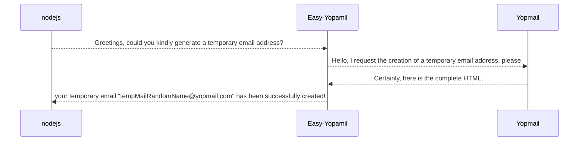
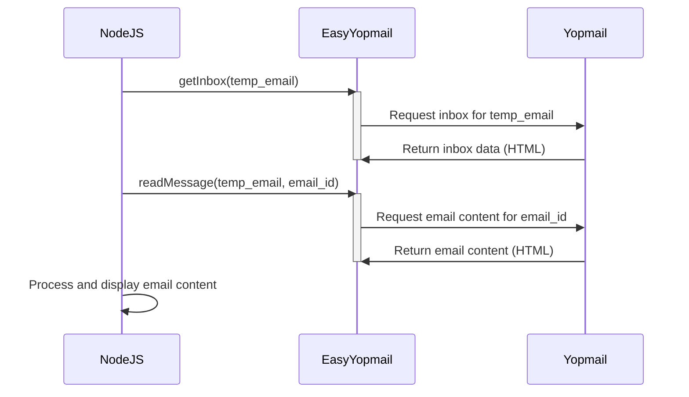
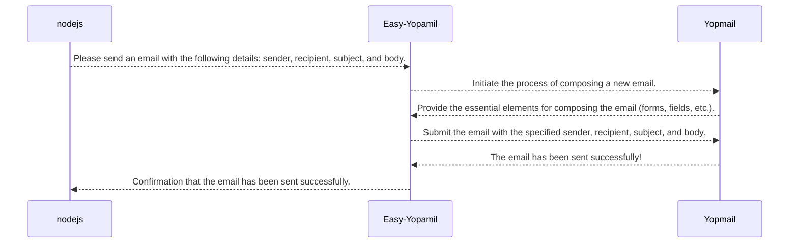
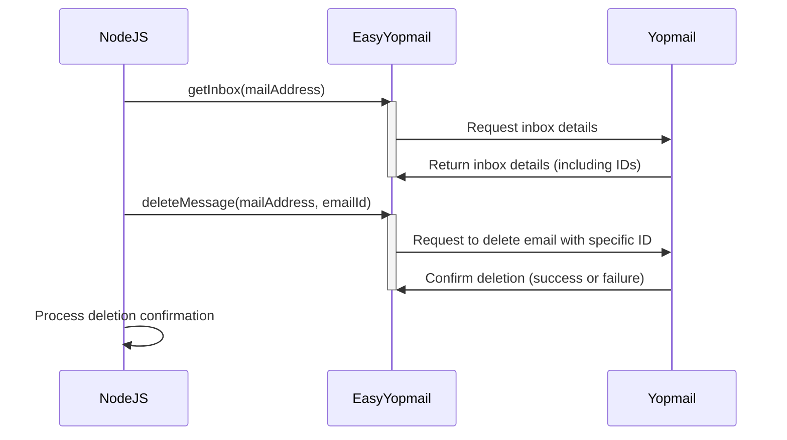
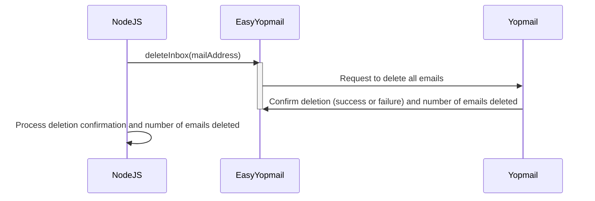

[//]: # (<show-structure for="chapter,procedure" depth="2"/>)

# 📧 EasyYopmail v5

<!--Writerside adds this topic when you create a new documentation project.
You can use it as a sandbox to play with Writerside features, and remove it from the TOC when you don't need it anymore.-->

    
        
    
    
    

## 🚀 Quick Start

Welcome to the Easy-Yopmail documentation! This page will give you an introduction to temporary emails and the full use
of the tool.

> {type:info} **You will learn:**
>
> - [What is a temporary email?](#title_1)
> - [What is YoPmail?](#title_2)
> - [What is Easy-Yopmail?](#title_3)
> - [How to use Easy-Yopmail?](#title_4)
> - [How to get temporary email?](#title_5)
> - [How to read a temporary email?](#title_6)
> - [How to write a temporary email?](#title_7)
> - [How to delete a temporary email?](#title_8)

<snippet id="installation-guide">
   <toc-element topic="deleteInbox.md"/>
   <toc-element topic="deleteMessage.md" toc-title="Initial setup"/>
   <toc-element topic="getInbox.md"/>
   <toc-element topic="getMail.md"/>
</snippet>

## 💡 What is a temporary email? {id="title_1"}

Temporary emails are disposable email addresses that you can use to register on websites or services without revealing
your real email address. They are useful when you need to receive a confirmation email to access a service or download a
file, but you don't want to share your personal email address.

#### Some of the temporary email services are:

 link                                             | description {style="color: #0000FF;"}                                                                                                                                                                           
--------------------------------------------------|-----------------------------------------------------------------------------------------------------------------------------------------------------------------------------------------------------------------
 [Yopmail](https://yopmail.com/)                  | Yopmail is a popular temporary email service that allows you to create a temporary email address and receive emails without registration. You can use the email address for a short period and then discard it. 
 [Temp Mail](https://temp-mail.org/)              | Temp Mail is another temporary email service that provides disposable email addresses for free. You can use the email address to receive emails and then delete it when you no longer need it.                  
 [10 Minute Mail](https://10minutemail.com/)      | 10 Minute Mail is a temporary email service that provides email addresses that expire after 10 minutes. You can use the email address to receive emails and then discard it.                                    
 [Guerrilla Mail](https://www.guerrillamail.com/) | Guerrilla Mail is a temporary email service that offers disposable email addresses for free. You can use the email address to receive emails and then delete it when you no longer need it.                     
 [Mailinator](https://www.mailinator.com/)        | Mailinator is a temporary email service that provides disposable email addresses for free. You can use the email address to receive emails and then discard it.                                                 

## 💡 What is YoPmail? {id="title_2"}

Yopmail is a popular temporary email service that allows you to create a temporary email address and receive emails
without registration. You can use the email address for a short period and then discard it.

#### Why use Yopmail?

No registration required, You can create a temporary email address without having to register or provide any personal
information. In addition, the structure of this page allows you to
implement [Web Scraping](https://es.wikipedia.org/wiki/Web_scraping) in a simpler way than on competing portals. Allows
extraction in an easier and more direct way.

#### What YOPmail looks like on the inside:

Let's take a glimpse inside YoPmail through these screenshots that showcase its most fundamental functions.

**🔎 how the "index" page look on YoPmail**

**🔎 How the 'Generate Email' page looks on YoPmail**

**🔎 How the 'Inbox and body email' page looks on YoPmail**

## 💡 What is Easy-Yopmail? {id="title_3"}

A powerful [NPM](https://www.npmjs.com/package/easy-yopmail) library designed for [NodeJS](https://nodejs.org/en). This
tool was born from the need to simplify the generation of random emails, the management of inboxes and the reading of
received messages, all without the need to manually interact with any web interface.

**Easy-Yopmail** is based on the [YOPmail](https://yopmail.com/) platform and operates completely asynchronously. Its
intuitive design and efficiency make it an indispensable tool for scraping, automated testing, and any process that
requires efficient email management.
With Easy-Yopmail, you can focus on what really matters: developing your application. Let our bookstore take care of the
email for you.

Join the community of developers who are already taking advantage of Easy-Yopmail. Install it today from NPM and see how
it can simplify your workflow!

<procedure title="The main features of Easy-Yopmail include:" id="1" type="choices">
    <step><b>Random Email Generation: </b> Create unique and random email addresses with a single command.</step>
    <step><b>Inbox Management: </b> Access and list the inbox of any Yopmail email address.</step>
    <step><b>Reading Emails: </b> Read received emails without having to interact with any web interface.</step>
    <step><b>Asynchronous Operation: </b> All Easy-Yopmail functions run asynchronously, allowing for a seamless workflow.</step>
    <step><b>Easy Integration with NodeJS: </b> As an NPM library, Easy-Yopmail integrates seamlessly with any NodeJS project.</step>
    <step><b>Based on YOPmail: </b> Easy-Yopmail uses the YOPmail platform, which guarantees the reliability and efficiency of its functions.</step>
</procedure>

## 📦 How to use Easy-Yopmail? {id="title_4"}

We will teach you how to use Easy-Yopmail, a tool that allows you to create and manage temporary email addresses. With
Easy-Yopmail, you can generate temporary email addresses, receive emails and manage your inbox simply and quickly.
These are the first steps to use Easy-Yopmail:

<procedure title="Prerequisites" id="inject-a-procedure" type="choices">

<b>Before you begin, please ensure that you:</b>
    
<step> - Have Node.js installed on your computer. </step>
    <step> - Have npm (Node Package Manager) installed on your computer.</step>
    <step> - Have created your project folder.</step>
    <step> - initialize a nodejs project with <code>npm init -y</code> command.</step>
    <step> - Are in your project's directory path from the terminal.</step>
</procedure>

> If you don't understand any of these steps. You are invited to explore how to create a Nodejs project in
> this [link](https://youtu.be/yB4n_K7dZV8?list=PLUofhDIg_38qm2oPOV-IRTTEKyrVBBaU7). You can return when you complete the
> requirements
>
{style="note"}

#### Install the Easy-Yopmail library

You can install the library using [NPM](https://www.npmjs.com/) or [Yarm](https://yarnpkg.com/)

<tabs>
    <tab title="npm">
        <code-block lang="plain text">
            npm i easy-yopmail
        </code-block>
    </tab>
    <tab title="yarn">
        <code-block lang="xml">
            yarn add easy-yopmail
        </code-block>
    </tab>
</tabs>

## 📭 How to get temporary email? {id="title_5"}

**Easy-YOPMail** `getMail()` function allows developers to dynamically generate random email addresses. This feature is
especially useful when you need a unique and temporary email address without having to interact with a web interface or
perform any additional configuration.

#### Diagram how it works getMail() function

<procedure title="Writing code" id="2" type="steps">
<step> 

 To get a temporary email address using Easy-Yopmail, follow these steps:

<video src="code_animation_1.mp4"/>
</step>
<step>

You can copy the code and paste it into your project.

<code-block lang="javascript" collapsible="true" default-state="collapsed">
    //code to example
    const easyYopmail = require('easy-yopmail');
    easyYopmail.getMail().then(function(email){ 
        console.log(email); 
    });
</code-block>
</step>
    <step>remember to run your project to view the results in your terminal.</step>
</procedure>

> You can view and run the complete code using **<tooltip term="runkit">runkit</tooltip>**. Follow
> this [link](https://runkit.com/jasp402/easy-yopmail-getmail) {style="note"}

## 📬 How to read a temporary email? {id="title_6"}

To read an email, it is necessary to utilize two functions: getInbox() and readMessage(). We need to read the inbox of
the email account we wish to access the message for, and once we know the ID of the email we want to consult, we can
easily obtain the message using readMessage().

#### Diagram how it works read a temporary email 

In order to read an email it is necessary to use two functions. getInbox() and readMessage().
We need to read the inbox of the email to which we want to access your message and once the email ID is known
that we wish to consult. We can easily obtain the message using readMessage().

<procedure title="Writing code" id="3" type="steps">
    <step>
        

        <code-block lang="javascript" collapsible="true" default-state="collapsed">
            const easyYopmail = require('easy-yopmail');
            easyYopmail.getInbox('testEmail@yopmail.com').then(email=>{
            console.log(email.inbox);
            //we obtain an object with the property "Inbox" which is an array of objects
            //that contain the emails found.
                {
                id: 'e_ZwDjZmZkZwV0ZGN1ZQNjAGN1ZGLlBN==',
                    from: 'Disqus',
                    subject: 'Re: Comment on Rehab Afterlife',
                    timestamp: '17:41',
                    page: 5
                }
            });
        </code-block>
    </step>
    <step>
        

        <code-block lang="javascript" collapsible="true" default-state="collapsed">
            //once we get the ID we can query it directly using readMessage()
            easyYopmail.readMessage('testEmail@yopmail.com', 'e_ZwDjZmZkZwV0ZGN1ZQNjAGN1ZGLlBN==').then(message =>{
            console.log(message);
            });
            //we will obtain a result similar to this:
            {
                id: 'e_ZwDjZmZkZwV0ZGN1ZQNjAGN1ZGLlBN==',
                submit: 'Re: Comment on Rehab Afterlife',
                from: 'Disqus <notifications@maas.disqus.com>',
                date: 'Sunday, March 31, 2024 5:41:05 PM',
                deliverability: 'Your account has been credited',
                format: 'txt',
                selector: null,
                eq: null,
                attribute: null,
                pathToSave: null,
                content: "You have a new reply from 𝓡𝓸𝓼𝓪 in Disqus Rehab View Reply New Channels are live: Anime, Pets, and Literature! Check them out Disqus, 1 California St., Suite 1225, San Francisco, CA 94111 You're receiving this messa
                ge because you've signed up for Disqus notifications. Unsubscribe Change Email Notifications id-2889cd94c1154f27b3b05244a67d7005",
                info: []
            }
        </code-block>
    </step>
</procedure>

## 📝 How to write a temporary email? {id="title_7"}

Easy-Yopmail also facilitates sending emails from the temporary address you generated. Its writeMessage() function allows you to compose and send emails directly within your NodeJS application, streamlining your email workflow.
Diagram of how the writeMessage() function operates:

Sending an Email with Easy-Yopmail
To send an email using Easy-Yopmail, follow these steps:
First, make sure you have installed the Easy-Yopmail library as described in the previous section.

In your NodeJS code, import the Easy-Yopmail library:

const easyYopmail = require('easy-yopmail');
Use the `writeMessage()` function to send an email. You will need to provide the following parameters:

- `mail` (string): The temporary email address from which you want to send the email (e.g., "yourTempEmail@yopmail.com").
- `to` (string): The recipient's email address.
- `subject` (string): The subject of the email.
- `body` (string): The body of the email.

Here's an example of how to use the `writeMessage()` function:

<procedure title="Writing code" id="4" type="steps">
    <step>
            <code-block lang="javascript" collapsible="true" default-state="collapsed">
                    const easyYopmail = require('easy-yopmail');
                    let mail = 'yourTempEmail'; //host is @yopmail.com by default
                    let to = 'recipient'; //host is @yopmail.com by default
                    let subject = 'Test Email';
                    let body = 'This is a test email sent from Easy-Yopmail.';
                    easyYopmail.writeMessage(mail, to, subject, body).then(function(response){ 
                            console.log(response); // Output: Your message has been sent 
                    });            
            </code-block>
    </step>
</procedure>

## 🗑️ How to delete a temporary email? {id="title_8"}

With Easy-Yopmail you have two options for deleting emails: you can delete a specific email using its ID with the deleteMessage() function or you can delete all emails in an inbox using the deleteInbox() function.
Deleting a Specific Email
Identify the Email ID: Use the getInbox() function to retrieve a list of emails in the inbox, including their IDs.
Use the deleteMessage() Function: Call the function with the email address and the ID of the email you want to delete.
Handle the Response: The function will return a message indicating whether the email was successfully deleted or not.

<procedure title="Deleting a Specific Email code" id="5" type="steps">
    <step>
            <code-block lang="javascript" collapsible="true" default-state="collapsed">
                    const easyYopmail = require('easy-yopmail');
                    easyYopmail.getInbox('example@yopmail.com')
                    .then(inbox => {
                    const emailIdToDelete = inbox.inbox[0].id; // Get the ID of the first email
                    easyYopmail.deleteMessage('example@yopmail.com', emailIdToDelete)
                    .then(response => {
                    console.log(response); // Output: "The mail with ID [emailIdToDelete] has been successfully deleted."
                    });
                    });
            </code-block>
    </step>
</procedure>

Deleting All Emails in an Inbox
Use the deleteInbox() Function: Call the function with the email address of the inbox you want to empty.
Handle the Response: The function will return a message indicating whether the inbox was successfully emptied or not. It will also tell you how many emails were deleted.

<procedure title="Deleting All Emails in an Inbox code" id="6" type="steps">
    <step>
            <code-block lang="javascript" collapsible="true" default-state="collapsed">
                    const easyYopmail = require('easy-yopmail');
                    easyYopmail.deleteInbox('example@yopmail.com')
                    .then(response => {
                    console.log(response); // Output: "The inbox of the email [example@yopmail.com] has been deleted. X emails have been deleted."
                    });
            </code-block>
    </step>
</procedure>

<seealso>
    <category ref="related">
        <a href="getMail.md">Topic about links</a>
        <a href="getInbox.md"/>
    </category>
    <category ref="external">
        <a href="https://www.google.com">Google</a>
        <a href="https://www.jetbrains.com"/>
    </category>
    <category ref="wrs">
        <a href="https://plugins.jetbrains.com/plugin/20158-writerside/docs/markup-reference.html">Markup reference</a>
        <a href="https://plugins.jetbrains.com/plugin/20158-writerside/docs/manage-table-of-contents.html">Reorder topics in the TOC</a>
        <a href="https://plugins.jetbrains.com/plugin/20158-writerside/docs/local-build.html">Build and publish</a>
        <a href="https://plugins.jetbrains.com/plugin/20158-writerside/docs/configure-search.html">Configure Search</a>
    </category>
</seealso>